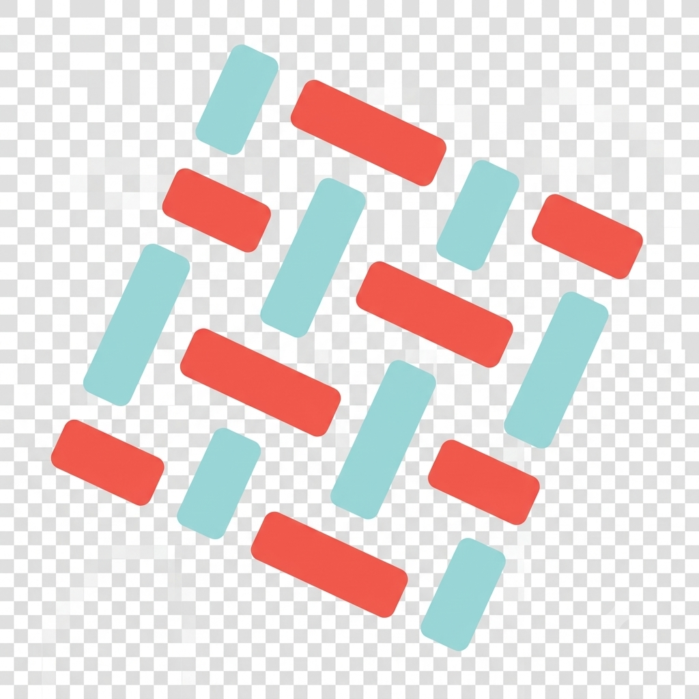

 

---

## 🧑‍💻 About Me

* 🔭 Building systems across **Web3, IoT, cybersecurity and AI/ML**
* ⛓️ Working with **Hyperledger Fabric, Ethereum, Solidity and Polygon**
* 🌐 Developing full-stack applications with **React, Node.js and Flask**
* 🔌 Building IoT systems using **ESP32, MQTT and embedded devices**
* 🔐 Exploring **network security, penetration testing and ethical hacking**
* 🤖 Working with **machine learning, computer vision and OCR**
* 🐳 Using **Linux, Docker and Git** for development and deployment

---

# 🛠️ Tech Stack

### 💻 Languages

### 🌐 Frontend

### ⚙️ Backend

### 🗄️ Databases

### ⛓️ Blockchain & Web3

### ☁️ Cloud, DevOps & Infrastructure

### 🔌 IoT & Embedded

### 🤖 AI, ML & Computer Vision

### 🔐 Cybersecurity

### 🧰 Tools & Platforms

---

## 📊 GitHub Activity

---

## 🐍 Contribution Graph

<picture>
  <source
    media="(prefers-color-scheme: dark)"
    srcset="https://raw.githubusercontent.com/psamuelvijay/psamuelvijay/output/pacman-contribution-graph-dark.svg">
  <source
    media="(prefers-color-scheme: light)"
    srcset="https://raw.githubusercontent.com/psamuelvijay/psamuelvijay/output/pacman-contribution-graph.svg">
  
</picture>

