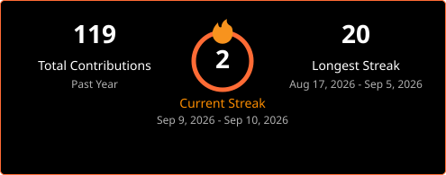

 

&nbsp;

&nbsp;

&nbsp;

---

## 🧑‍💻 About Me

* 🔭 Building systems across **Web3, IoT, cybersecurity and AI/ML**
* ⛓️ Working with **Hyperledger Fabric, Ethereum, Solidity and Polygon**
* 🔐 Exploring **network security, penetration testing and ethical hacking**
* 🤖 Working with **machine learning, computer vision and OCR**

---

## 🛠️ Tech Stack

&nbsp;&nbsp;

&nbsp;&nbsp;

  

&nbsp;&nbsp;

  

&nbsp;&nbsp;

&nbsp;&nbsp;

  

---

## 📊 GitHub Activity

  

---

## 🐍 Contribution Graph

  <picture>
    <source
      media="(prefers-color-scheme: dark)"
      srcset="https://raw.githubusercontent.com/psamuelvijay/psamuelvijay/output/pacman-contribution-graph-dark.svg">
    <source
      media="(prefers-color-scheme: light)"
      srcset="https://raw.githubusercontent.com/psamuelvijay/psamuelvijay/output/pacman-contribution-graph.svg">
    
  </picture>

---

